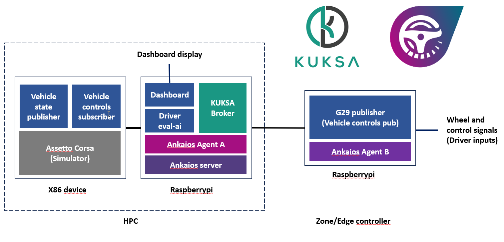

# DriveSim-by-wire

## Introduction

DriveSim-by-wire is a platform designed to seamlessly collect and process control signals from the vehicle's input peripherals, such as the steering wheel and pedals. These control signals can then be used to control a simulation environment (e.g. Asetto Corsa) to evaluate and improve the driver's behaviour and driving techniques. The platform can also provide entertainment for the driver by taking advantage of the vehicle controls to interact with a driving game (or any other game) while the car is parked (e.g. plugged in to charger)

## System architecture

The system consists of multiple containarized workloads that are orchestrated and managed by Ankaios framework. The data layer is built on the Vehicle Signal Specification (VSS) and is using Eclipse Kuksa Databroker implementation of VSS for seamless integration of the different workloads

The data layer is based on the Vehicle Signal Specification (VSS) by using Eclipse Kuksa Databroker. Such approach enables standarized access to the vehicle control data, ensuring seamless integration with our simulation and environment and driver evaluation workload.

### Data model

### Key components

#### Eclipse Databroker
#### Logitech G29 publisher
#### Simulation environment
#### Dashboard
#### Vehicle controller
#### Data evaluation
